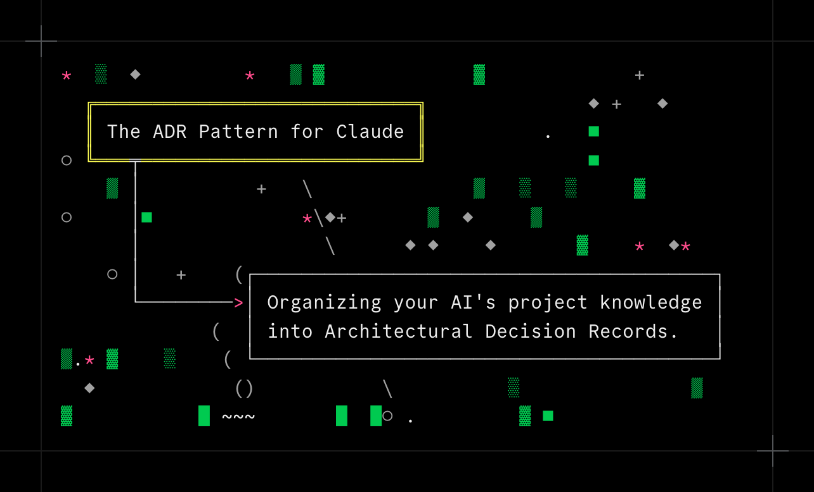

A pattern I've enjoyed recently when using Claude Code is the in-repo ADR ("Architectural Decision Record") pattern. I'll give an example of how to set it up and how I typically use it.

## Overview

The idea behind the ADR pattern is that you have lots of relatively small, focused markdown files, each describing a specific aspect or feature of your project. Here's an example of an `adr/` folder from a small project I worked on recently:

```text
adr/
  001-package-management.md
  002-development-workflow.md
  003-deployment-strategy.md
  004-architecture-overview.md
  005-authentication-saml.md
  006-github-integration.md
  .
  .
  .
```

As you can guess, each file in this folder is written by Claude, although sometimes I'll hand-edit to remove unnecessary lines or make a rule more explicit. As an example, here's the first file, `001-package-management.md`:

````md
# ADR-001: Package Management

## Context

Monorepo with 5 packages (web, agent, core, cli, feedback-worker) requiring consistent dependency management and cross-package version synchronization.

## Decision

Use PNPM 10 as the exclusive package manager with workspace configuration.
Enforce version consistency across packages using syncpack.

## Consequences

All developers must use `pnpm` commands instead of `npm`.
When updating a package version in one project, it must be updated in ALL projects.
Package manager is enforced via `packageManager` field in package.json.

## Usage

```bash
# From inside a project folder:
pnpm build           # build
pnpm test            # test
pnpm add <package>   # add new dependency
# From root:
pnpm install         # install dependencies
pnpm build:all       # build all packages
pnpm test:all        # test all packages
pnpm dev:web         # start web development server
```
````

Of course, Claude won't know about this folder full of useful markdown files unless we tell it, which I do at the bottom of my `CLAUDE.md`:

```md
## Before Making Changes

**Check ADRs first**: Before significant modifications, review the ADR list below for relevant architectural decisions and read them for context.

## Architecture Decision Records (ADRs)

See `/adr/` directory for detailed decisions:

- `001-package-management.md` - PNPM usage and workspace setup
- `002-development-workflow.md` - Build and development processes
- `003-deployment-strategy.md` - DEV/PROD deployment pipeline
- `004-architecture-overview.md` - System architecture and services
- `005-authentication-saml.md` - Authentication strategies
- `006-github-integration.md` - GitHub webhook and PR processing
- .
- .
- .
```

## The ADR Command

Now, your mileage may vary, but my experience with "global instructions" like this is very mixed. Sometimes Claude seems to know exactly what you wanted, other times it completely ignores the ADRs or fails to read the appropriate ADR before planning a new change.

The way to fix this is with a "hook" -- something in a new session that explicitly tells Claude you want to use ADRs. To accomplish this, I actually add an `/adr` _command_ for Claude Code in a new project. This would go in the file `.claude/commands/adr.md` within your project, and here's my version:

```md
Plan a new task:

- Consult CLAUDE.md for the list of current ADRs
- $ARGUMENTS
- Before planning this task, read any relevant ADRs
- If this would make any statements in those ADRs obsolete, include ADR updates in your plan
- If this plan requires a new ADR, confirm with me. New ADRs must also be added to the list in CLAUDE.md.
```

Whatever you type after `/adr ` in the Terminal gets inserted in place of the `$ARGUMENTS` keyword. This tiny piece of boilerplate allows me to boot up a new Claude session, hit Shift+TAB to enter plan mode, and type something like this:

```md
/adr Every time a user logs in, we should update a "last logged in" timestamp in the users table in the database. If a user fails to log in, we should update a "last failed signin" timestamp. Add these 2 fields to the database and show both fields on the users list in the admin portal.
```

The little `/adr` addition ensures that as Claude begins planning, it'll first evaluate the list of ADRs and load in any that seem relevant to this task. Then, when it presents the plan for me to tweak and approve, the plan will include specific tasks on the checklist for creating and/or updating any ADRs, so that our new feature is part of the permanent record.

## Why ADRs?

The advantage of this style of record-keeping is that it allows you to keep your `CLAUDE.md` (your main entrypoint) as small as possible, keeping tokens free in your context for actual planning and coding. (After reorganizing my example project above using ADRs, the size of my CLAUDE.md dropped to under 2kb!)

If you're asking Claude to tweak some CSS sheets, as an example, it probably _does_ want detailed information about your Tailwind decisions, but it _doesn't_ need to load in your list of database tables or your SAML authentication flow. This can be a very nice token savings as the number of features in the project grows.

One potential disadvantage, is that all of these little context files can easily rot over time, with specific lines becoming out of date as you update your application (or in some cases, entire ADR files that are no longer relevant). Using the `/adr` command can help; coming in and asking Claude to review the full ADR list and suggest any updates periodically can also combat this rot.

Give it a shot in your next project and see what you think!
