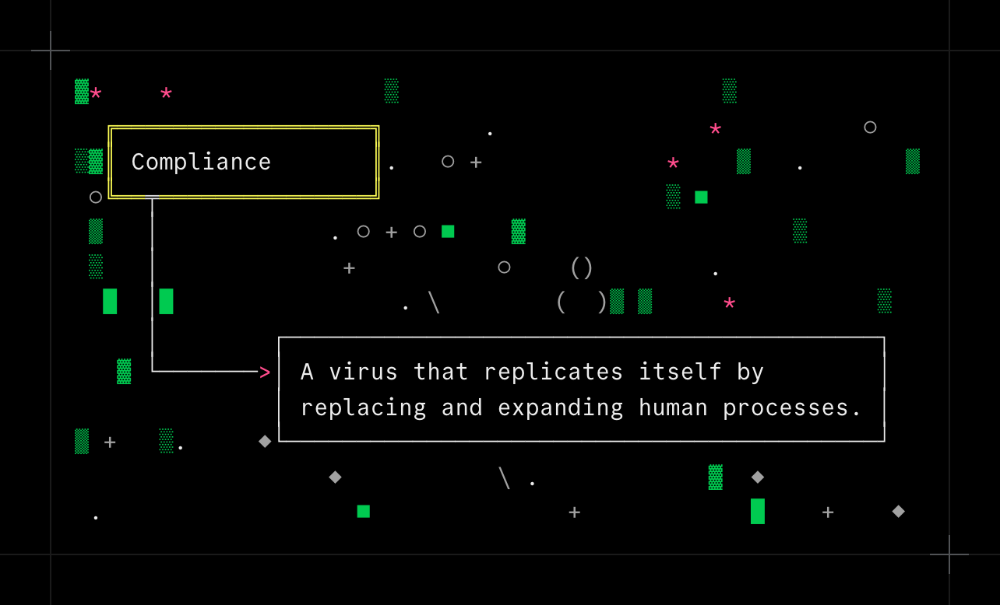

Engineers? Sure, they used to write their own Idea tickets. Back before Compliance.

To be fair to the project managers, it wasn't their fault -- not exactly. The VPs had been leaning on them for years, demanding more standardization and visibility. When the executive team finally got their hands on AI, it was only a matter of time before they started asking it how to organize product work, and the answer was a cascade of frameworks: SAFe, SIS2, GIST, PRISM. Of course every framework carried its own unique set of acronyms, acceptance criteria, and required fields; the Idea ticket form started growing longer every quarter.

The PMs did their best, but you can't manually review hundreds of tickets a sprint against a growing rubric over thirty pages long. So they asked for help -- just a lightweight review bot, a simple prompt. Something that could check for required data points, flag obvious gaps, validate a few fields. After all, what better way to guarantee that all the work moving through the system has measurable goals and is aligned with the company's KPIs?

That validator was Compliance v1. A few engineers could get tickets past it first try (although not many). But, if you were persistent enough, and kept fixing flagged issues, pretty much anyone could eventually get a ticket through.

By Compliance v3, it was over. The new unified standard, ensuring that the combined rulesets and goals of every endorsed framework were met, was a self-reinforcing web of documents that no one in the company had read in its entirety. Rejection comments were polite, but relentless: a missing edge case in the acceptance criteria, success metrics with insufficient data, missing security impact questionnaire, too many implementation details, too few implementation details, user stories that failed to include all PRISM personas.

The holdouts didn't last long, because no unassisted human could craft a valid Idea ticket by hand. The gap between what a person could anticipate and what Compliance would flag was simply too wide. You'd fix one comment, resubmit, and get three more. The only reasonable thing to do was use AI to help _write_ your tickets. Engineers scrambled to come up with the best prompts: lists of required fields, examples of passing and failing tickets, and so on. The rejection rate began dropping as more and more engineers used AI to help write their tickets.

In hindsight, the end state is obvious: hand-written prompts are just too long, too fragile, and too specific. The best way to get a passing Idea ticket was to ask the AI to review a month's worth of comments from Compliance, and build you a prompt that guaranteed a passing ticket. The definitive Idea Ticket Guide it produced was eleven pages long; nobody bothered reading it. Instead, we fed it to back into the AI, and out popped perfect Compliance-ready tickets.

It's not clear whether any work is actually getting done. But the tickets have never looked better.
