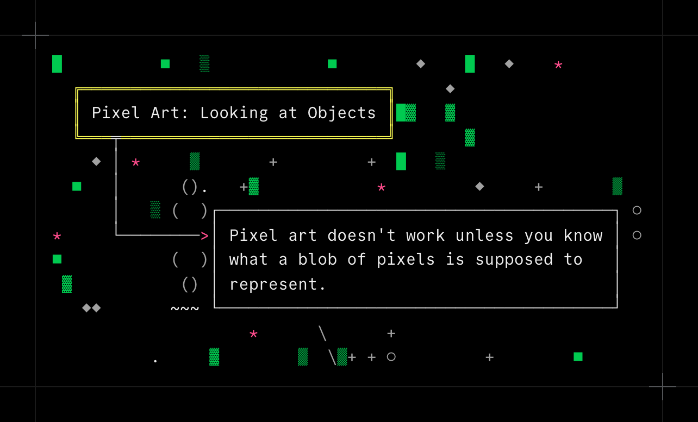
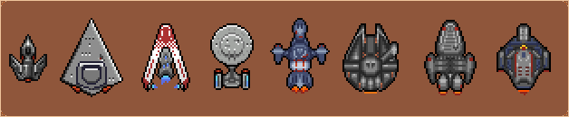
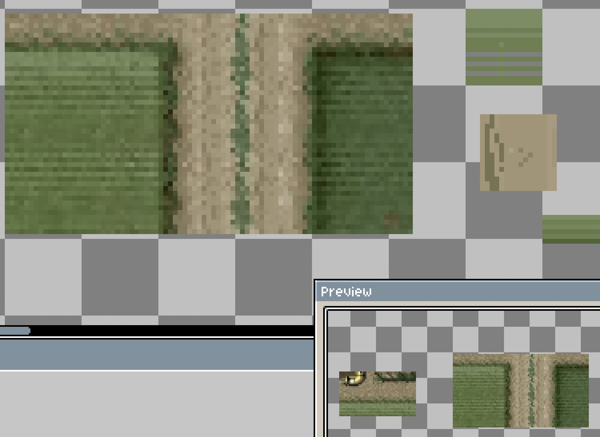

Recently I've been trying to hone my pixel art skills through deliberate practice, and as I thrash around trying various techniques, I'm realizing I've been doing this "wrong" for a long time. Or maybe not wrong, exactly, but definitely trying to take a shortcut.

For me, it became obvious when I was drawing spaceships. As practice, I gave myself a challenge to draw pixel art versions of famous sci-fi ships -- here's my scratchpad of various attempts (in order: the main ship from the video game Tyrian 2000 redrawn by me, the Executer from Star Wars, the Razorback from Expanse, Enterprise NCC-1701-D from Star Trek, the Serenity from Firefly, the Millenium Falcon from Star Wars, the Battlestar Galactica, and the NCC 75633 Defiant from Star Trek).

The shortcut I realized that I'm trying to take is that, essentially, I just want it to "look good". So I look at various pixel art styles, look at those clumps of pixels, and try to copy the style (generally without much success). When I look at pictures of these spaceships, I see blobs of this and that, so I keep adding and subtracting pixels. I'm trying to make it look less flat, less ugly, and more lifelike; sometimes I have some success but mostly I'm just treading water.

What I was missing is that these ships don't just have "random blobs" all over them -- they have windows, cockpits, wings, engines. An indented plate of metal has _some purpose_ -- maybe it's a vent, or a fan, or maybe it's a closed loading dock or an escape pod, or maybe it's a locked machine gun turret. Lines and circles all over the ship aren't just decorations, maybe it's cabling or wires or "ion refractors". The key takeaway is: if you don't know or care what the actual object is you are drawing, what that blob of pixels is supposed to represent, you have very little chance of making it look good in your own art.

Once you realize this you start to see it everywhere. As an example, I was recently poring over some screenshots of the classic video game Raiden 2 while working on my own vertical shmup, and for each tile you start asking yourself "why does this look the way it does?"

The green tiles are not just "grass with lines" -- it looks like maybe it's soybeans or some other crop, planted in rows. The road is not just randomly pixelated dirt -- it's showing a dirt road compacted by heavy trucks and tanks, with grass poking through in the middle. And so on.

I don't think this realization immediately makes my art look any better, but I'm hoping that it'll make my practice sessions a lot more effective. We'll see!
